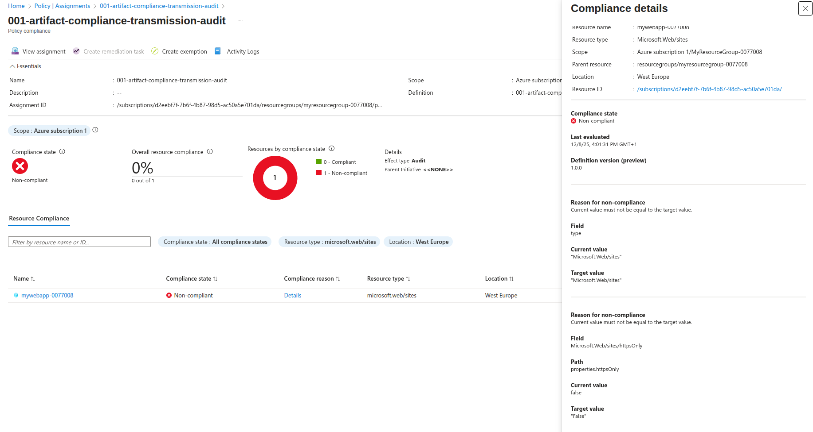
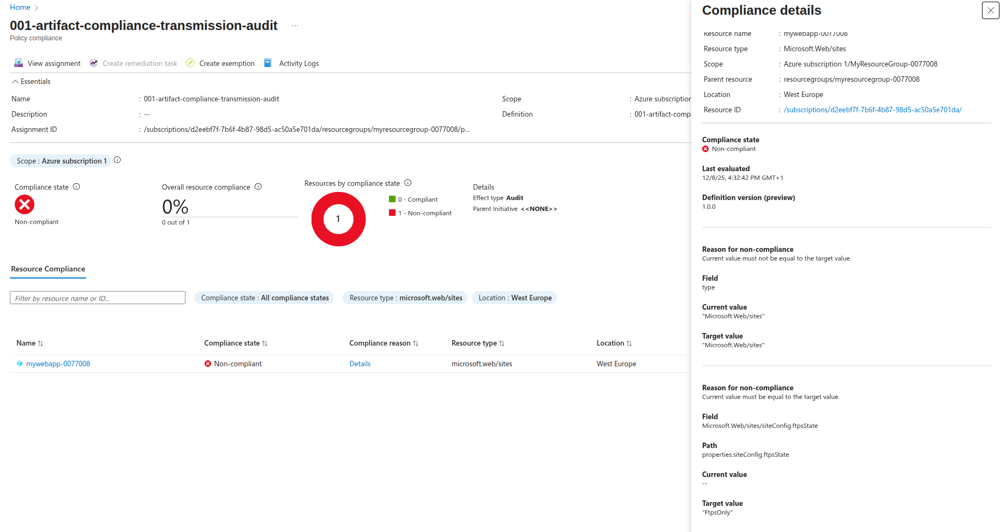
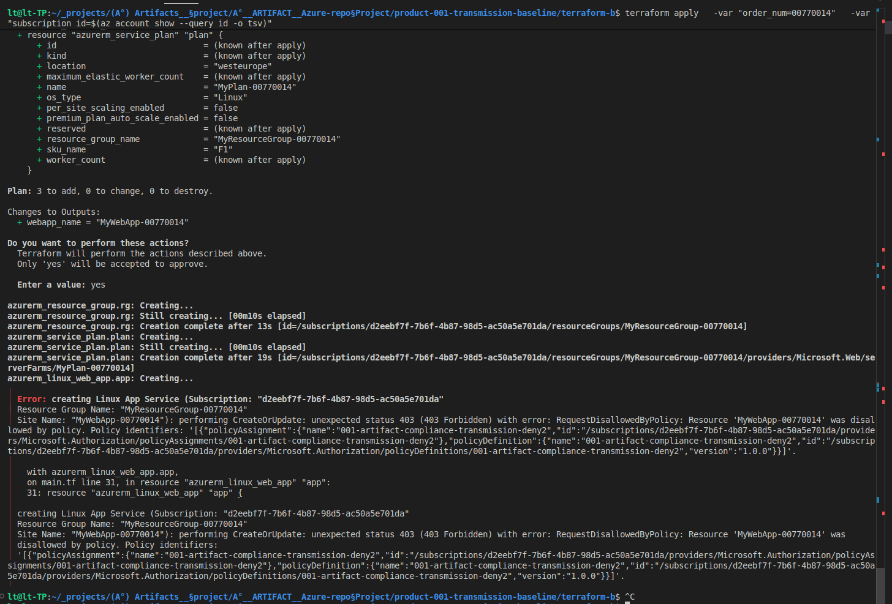
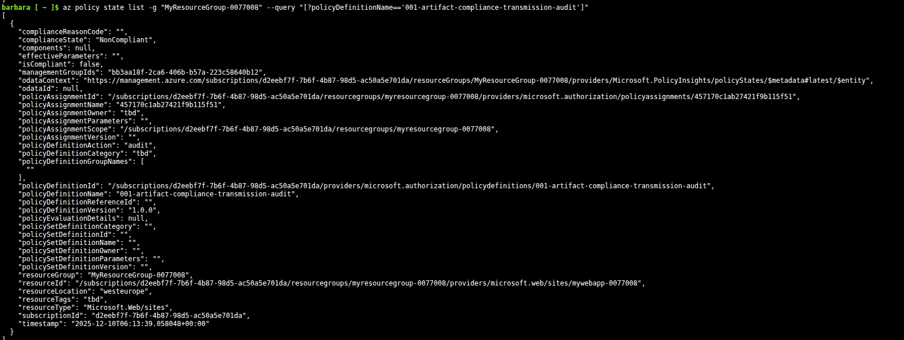

[//]: 001-artifact-compliance-transmission-ReadMe

[return to main page](../README.md)

# Product 1 – Transmission Security Baseline


These controls reduce the risk of data exposure during transmission.

Controls covered:
- minTlsVersion → prevents downgrades to insecure TLS versions.
- httpsOnly → enforces encrypted HTTP transport.
- ftpsState → blocks plaintext FTP and prevents accidental re-enablement of insecure channels.


# Audit and Enforcement

## 1. HTTPS audit

Azure Policy detected `httpsOnly = false` and marked the resource as `NonCompliant`, because the expected value is `true`.

## 2. FTPS audit

Azure Policy detected an empty `ftpsState` value and marked the resource as `NonCompliant`, because the expected value is `FtpsOnly`.

## 3. TLS 1.2 deny enforcement

Terraform intentionally attempts to deploy an App Service with `minimum_tls_version = "1.0"`.

The deny policy rejects the deployment with HTTP 403 `RequestDisallowedByPolicy`, confirming that TLS versions below 1.2 cannot be deployed.

The policy targets `Microsoft.Web/sites` and evaluates the intended fields: `httpsOnly`, `siteConfig.ftpsState`, and `siteConfig.minTlsVersion`.

- Azure Portal evidence confirms HTTPS and FTPS non-compliance.





- Terraform evidence confirms that an App Service configured with TLS 1.0 is blocked by the deny policy.



- Azure CLI confirms that the audited resource is reported as `NonCompliant`.




# Technical Documentation

Non-compliant resource 
```bash
az login
terraform init
terraform apply   -var "order_num=0077015"   -var "subscription_id=$(az account show --query id -o tsv)"

```
Policy definition & assignment
```pwsh

az account list --output table

# az login --tenant <TENANT_ID_OR_DOMAIN>
# az account set --subscription <SUBSCRIPTION_ID>
# file path = /home/lt/_projects/security-audit-runbooks/artifacts

$subId = az account show --query id -o tsv
$subId

code 001-artifact-compliance-transmission-audit.json
cat 001-artifact-compliance-transmission-audit.json

az policy definition create `
  --name "001-artifact-compliance-transmission-audit" `
  --rules "./001-artifact-compliance-transmission-audit.json" `
  --mode All `
  --subscription $subId

az policy assignment create `
  --name "001-artifact-compliance-transmission-audit" `
  --policy "/subscriptions/$subId/providers/Microsoft.Authorization/policyDefinitions/001-artifact-compliance-transmission-audit" `
  --scope "/subscriptions/$subId/resourceGroups/MyResourceGroup-0077008"
```
Policy evaluation and non-compliance report.
```bash
az policy state list -g "MyResourceGroup-0077008" --query "[?policyDefinitionName=='001-artifact-compliance-transmission-audit']"

az policy state list -g "MyResourceGroup-0077008" --query "[].complianceState"

az policy state list -g "MyResourceGroup-0077008" \
  --query "sort_by(@, &timestamp)[-1].complianceState"
```


[go to next module](../product-002-keyvault-baseline/README.md)